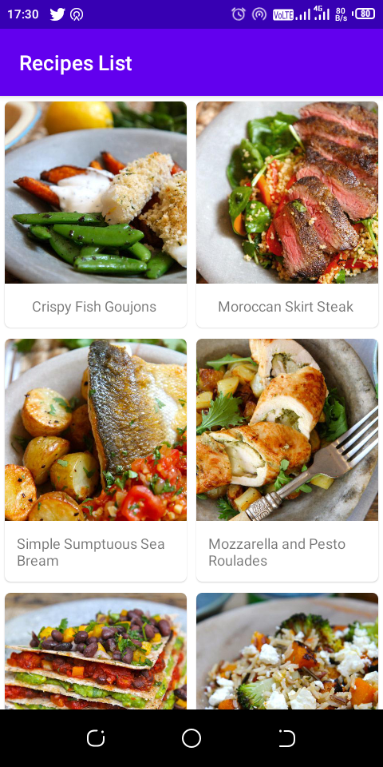

# RecipesApi
Simple Android kotlin app, consuming Recipe API to show a list of recipes via HTTP request. It's build with MVVM architecture pattern. Getting hands dirty on how to work with RESTful web Services in android. Built this to practice [Android Interviews: Take-home assessment tests questions](https://medium.com/@valentinerutto/android-interviews-take-home-assessment-tests-30223654c53a) by Valentine Rutto medium post.

# Screenshots

|<strong>Recipe List</strong>|<strong>Recipe Details</strong>|
|:--:|:--:|
|||

# Tools and Libraries used
- Retrofit - Type-safe HTTP Client for consuming RESTful API web services in android
- Gson - Kotlin/Java library for converting Kotlin/Java Objects into their JSON representation
- Glide - Image Loader Library for Android
- Navigation Components - Android Jetpack's component for implementing navigation for consistent and predictable user experience in android app
- ViewModel - Responsible for preparing and managing the data for an Activity or a Fragment
- Room - Persistence library that provides app local data storage by providing abstract layer over the SQLite Database
- Coroutines - Kotlin features for executing synchronous and asynchronous task/code in android

# Contributions & Support
- There is a Posibility of it being buggy! Help me fix the issue through pull request.
- Like it! then star ⭐ it!

